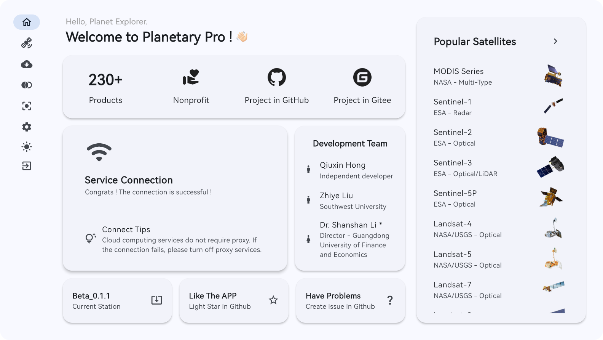
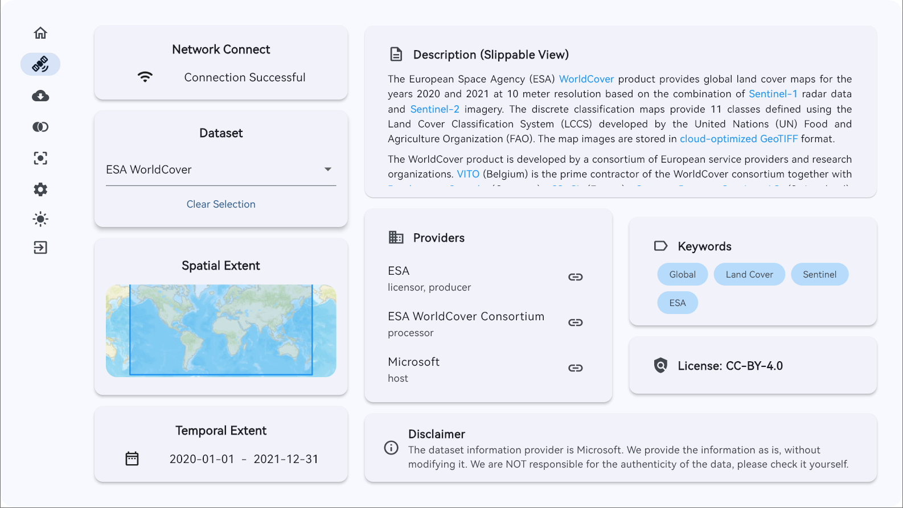
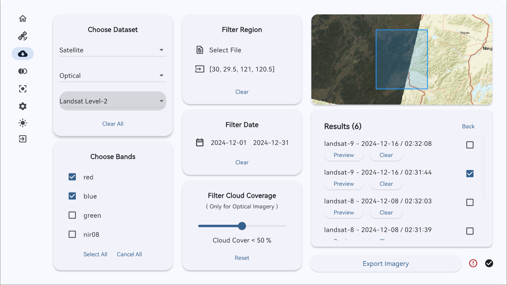
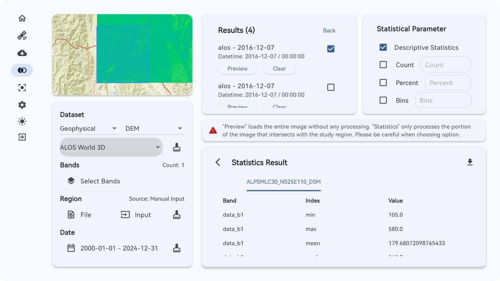
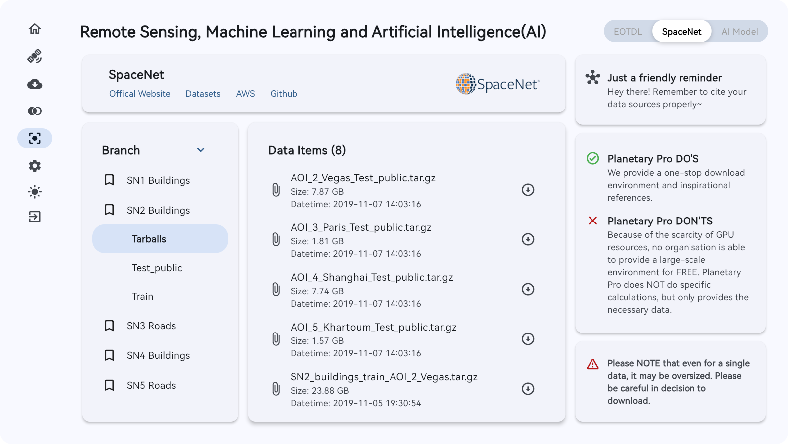
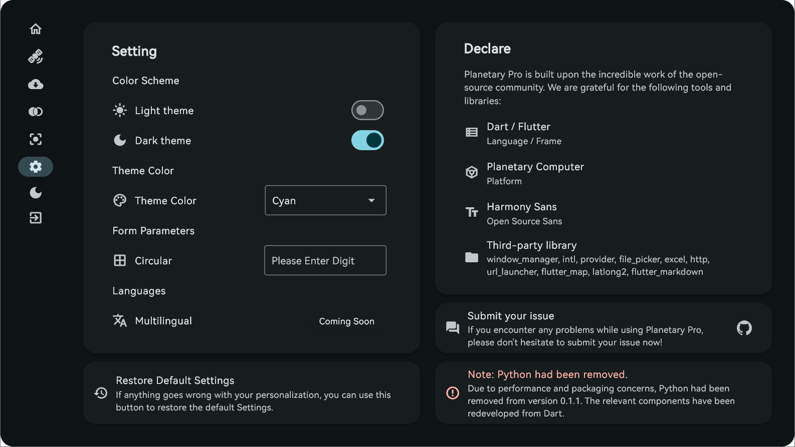

  
  <h3 align="center"><strong>Planetary Pro<strong></h3>
  

    <a href="./README.md">English</a> | <a href="./README.zh-CN.md">简体中文</a>
  

## Table of Contents

- [Table of Contents](#table-of-contents)
- [Project Overview](#project-overview)
- [Development Team](#development-team)
- [Update Notes](#update-notes)
- [Installation Guide](#installation-guide)
  - [1. Windows](#1-windows)
  - [2. Linux](#2-linux)
  - [3. MacOS](#3-macos)
- [User Guide](#user-guide)
  - [1. Imagery Information](#1-imagery-information)
  - [2. Image Export](#2-image-export)
  - [3. Regional Statistics](#3-regional-statistics)
  - [4. Machine Learning and Artificial Intelligence](#4-machine-learning-and-artificial-intelligence)
  - [5. Software Settings](#5-software-settings)
- [Disclaimer](#disclaimer)
- [Contact Information](#contact-information)

## Project Overview

Planetary Pro is a software platform built upon remote sensing cloud computing infrastructure. The main modules include imagery information, image export, regional statistics, and machine learning, designed to provide convenience for researchers and scholars.

Planetary Pro is a free, non-profit product that is available at no cost and is not intended for commercial use.

> Planetary Pro is currently in public beta testing.

## Development Team

Qiuxin Hong (Independent Developer), Zhiye Liu (Southwest University), Shanshan Li* (Guangdong University of Finance and Economics)
> *Dr Shanshan Li serves as the project advisor and correspondent.

## Update Notes

Planetary Pro v0.1.1 has been released with the following major updates:
1. Added Linux support with AppImage version available for various distributions;
2. Added two major modules: **Imagery Information** and **Machine Learning & AI**, with supported datasets increased to 230+;
3. Enhanced **Image Export** and **Regional Statistics** modules with map components, supporting data preview and selection;
4. Added settings functionality with light/dark mode switching and window parameter customisation.

> Planetary Pro has been restructured following Material 3 design principles. Python and its derivative components have been removed, with the software now built entirely in Dart/Flutter.

## Installation Guide

### 1. Windows
The software provides a Windows installer. After installation, locate and run **planetary.exe** in the installation directory. If shortcuts have been created on the desktop or start menu, these can be used to launch the application. The software can be uninstalled through system settings.

> New! A portable version is now available that requires no installation. Simply extract and run - no uninstallation needed.

### 2. Linux
The software is available in AppImage format, which can be run directly on Linux systems.

> Please note that AppImage support varies across different systems. Users may need to resolve dependencies independently.

### 3. MacOS
Unfortunately, due to the closed nature of MacOS, we are unable to provide MacOS builds at this stage. We will consider releasing a MacOS version when we acquire the necessary development hardware.

## User Guide

### 1. Imagery Information
The software now includes a dataset information viewing feature, providing information on approximately 124 datasets. This information covers geographical scope, time span, dataset descriptions, data providers, keywords, and licensing details.

> Imagery information is based on the Planetary Computer platform. Planetary Pro provides this data as-is without modification and makes no warranty or guarantee regarding the information.

> The map component utilises tile base maps provided by ArcGIS, which we acknowledge here. Planetary Pro makes no warranty or guarantee regarding the content or position of these maps.

### 2. Image Export
Users can export imagery by following these steps:
1. (Required) Choose Dataset: Select the desired dataset for export. Available datasets vary based on the chosen Classification, which in turn depends on the selected data type.
2. (Required) Choose Bands: Select the required bands for export. At least one band must be selected.
3. (Required) Filter Region: Define the area of interest using either a geojson file or by manually entering coordinate bounds. The geojson file must contain a single polygon feature.
4. (Required) Filter Date: Select the time period for the imagery products. Queries outside the product's temporal range may return zero results or fail.
5. (Optional) Filter Cloud Coverage: For optical remote sensing data, users can filter images with cloud coverage below a specified threshold. This parameter does not affect other types of imagery.

Once all parameters are set, users can query relevant images, preview them using the Preview function, and export selected items using the Export Imagery function.

> Note! Exported images will be clipped to the specified Region.

> To protect the remote sensing cloud computing servers, there are limits on download volume per session and a 30-second cooling period between downloads.

### 3. Regional Statistics

Users can export statistical values by following these steps:
1. (Required) Dataset: Select the desired dataset for analysis. Available datasets vary based on the chosen Classification, which in turn depends on the selected data type.
2. (Required) Bands: Select the required bands for analysis. At least one band must be selected.
3. (Required) Region: Define the area of interest using either a geojson file or by manually entering coordinate bounds. The geojson file must contain a single polygon feature.
4. (Required) Date: Select the time period for analysis. Queries outside the product's temporal range may return zero results or fail.
5. (Required) Statistical Parameters: Select the statistical parameters for the defined region. Descriptive statistics are selected by default.

Once all parameters are set, users can query images, preview them using the Preview function, and perform statistical analysis. Statistical results can be downloaded.

### 4. Machine Learning and Artificial Intelligence

The software supports two machine learning data platforms and several AI models:
1. EOTDL: The software integrates EESA's EOTDL remote sensing machine learning database, supporting account login, account information viewing, data browsing and downloading, and model browsing and downloading.
2. SpaceNet: The software includes SpaceNet versions 1-8 data, supporting data queries and downloads, with a maximum of 1000 entries per data load.
3. AI Models: The software provides download links for two AI models: Clay and Aurora. Clay is designed for remote sensing data analysis, whilst Aurora focuses on meteorological data analysis.

> Why do I need to log in to EOTDL? Browsing data and models doesn't require login, but downloading does. Planetary Pro follows the data provider's requirements.

> Why can't I train machine learning or AI models in Planetary Pro?
> Due to the scarcity of GPU resources, there currently isn't a platform that can support online training and analysis of large-scale remote sensing/meteorological data. Moreover, Planetary Pro is positioned as a data provision platform rather than a data analysis platform.

### 5. Software Settings

The software features new settings functionality, allowing users to switch between light and dark modes, and adjust window colours and corner radius parameters.

> Due to rendering issues, the development team has not yet implemented multi-language support, but this will be actively considered for future versions.

> Why can't I save my settings? 
> Due to programme crashes occurring when saving parameters during testing, which couldn't be consistently reproduced. the settings save feature will be introduced in the official release.

## Disclaimer
1. The software is currently in public beta testing and may experience bugs or compatibility issues due to different devices and systems.
2. This software is a free, non-profit product and is not intended for commercial use. The developers accept no responsibility for any use beyond educational purposes.
3. The software provides basic services only. Users are responsible for verifying the accuracy of results, and the developers are not liable for exported results or subsequent outputs.
4. The software acknowledges used components and features on each page where possible. Any oversights will be addressed in future versions, and we welcome your suggestions.
5. Users must comply with citation rules for data and derivative content. The software assumes no responsibility for missing citations.

## Contact Information
If you have any questions or suggestions about the project or software, please raise them in the GitHub issues section or contact us via email at geohqx@outlook.com.
