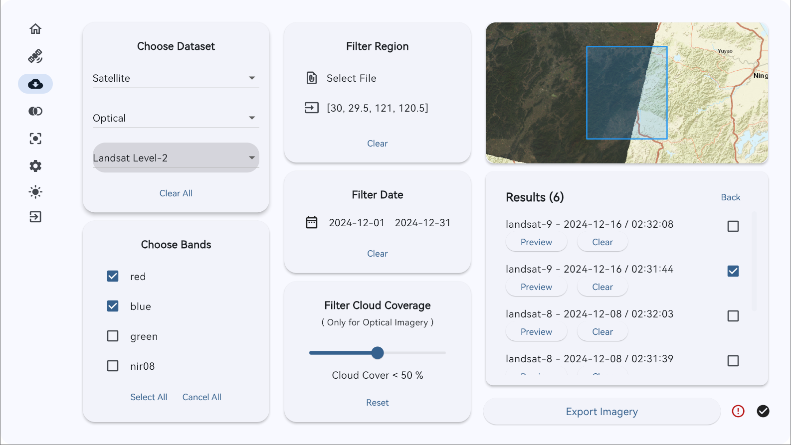
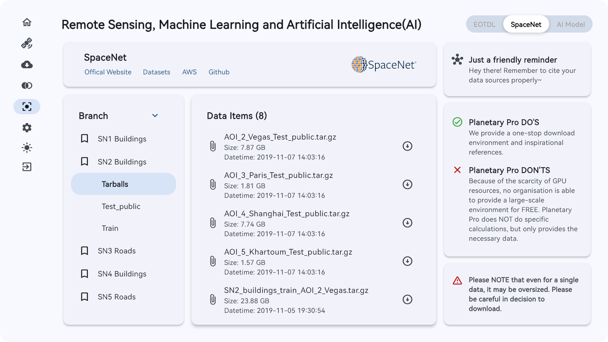

  
  <h3 align="center"><strong>Planetary Pro<strong></h3>
  

    <a href="./README.md">English</a> | <a href="./README.zh-CN.md">简体中文</a>
  

## 目录

- [目录](#目录)
- [项目简介](#项目简介)
- [开发团队](#开发团队)
- [更新说明](#更新说明)
- [安装指南](#安装指南)
  - [1. Windows](#1-windows)
  - [2. Liunx](#2-liunx)
  - [3. MacOS](#3-macos)
- [使用说明](#使用说明)
  - [1. 影像信息](#1-影像信息)
  - [2. 影像导出](#2-影像导出)
  - [3. 区域统计](#3-区域统计)
  - [4. 机器学习与人工智能](#4-机器学习与人工智能)
  - [5. 软件设置](#5-软件设置)
- [免责申明](#免责申明)
- [联系方式](#联系方式)

## 项目简介

Planetary Pro是一款依托遥感云计算平台的软件，主要模块包含影像信息、导出影像、区域统计和机器学习，为广大研究学者提供便利。

Planetary Pro是一款免费的非盈利产品，在使用过程中不收取任何费用，并且不为商用产品。

> Planetary Pro目前处于公众测试阶段。

## 开发团队

洪秋鑫（独立开发者）、刘智业（西南大学）、李姗姗*（广东财经大学）
> *李姗姗博士为项目的指导与通讯。

## 更新说明

Planetary Pro 现推出 v0.1.1 版本，主要更新内容为
1. 新增 Linux 支持，发布适用于众多发行版的 AppImage 版本软件；
2. 新增 **影像信息**、**机器学习与人工智能** 两大模块，支持数据集增加至 230+；
3. **影像导出**和**区域统计**两个模块增加地图模块，并支持数据条目预览与选择；
4. 新增设置功能，支持深浅模式切换、颜色等窗口参数切换。

> Planetary Pro 按照 Material 3 风格进行重构，并在此次重构中移除了 Python 及其衍生组件，由 Dart/Flutter 独立完成。

## 安装指南

### 1. Windows
软件提供Windows安装包，安装后在目录中查找 **planetary.exe** ，打开后即可使用。如果用户在桌面或者开始菜单中创建了快捷方式，那么点击快捷方式即可使用。软件卸载可在设置中进行卸载。

> 新！ 软件发布了免安装版本，解压后即可使用。无需卸载，直接删除即可。

### 2. Liunx
软件提供 AppImage 格式的版本，在 Linux 中直接点击即可使用。

> 请注意，AppImage 的支持在不同系统中存在差异，请自行解决依赖问题。

### 3. MacOS
很遗憾，由于 MacOS 系统的封闭性，我们无法在现阶段完成 MacOS 的软件构建。如果后续我们增持了 MacOS 设备，我们会考虑上线相关版本。

## 使用说明

### 1. 影像信息
软件新增数据集信息的查看功能，共计提供约 124 个数据集的信息，信息涵盖涉及地域、时间跨度、数据集描述、数据提供方、关键词、许可证等内容。

> 影像信息基于 Planetary Computer 平台。Planetary Pro 按照数据原样提供，未做任何修改，并且不为相关信息进行任何审核或担保。

> 地图组件中的瓦片底图调用了 ArcGIS 提供的数据，在此做出说明。Planetary Pro 不对地图的内容和立场进行任何审核或担保。

### 2. 影像导出
用户可以根据以下步骤进行 **导出影像**：
1. （必选）Choose Dataset：用户根据需要选择Dataset，即导出的影像产品。Dataset根据用户选择的Classification而不同，而Classification根据用户选择的数据类型而不同。
2. （必选） Choose Bands： 用户可以根据使用需要自主选择需要的波段，导出影像时只导出选择的影像。波段选择不能为空。
3. （必选）Filter Region：定义感兴趣区，用户可以通过 geojson 文件或手动输入研究区域的四至来进行下载。其中，geojson 文件必须为单个面要素文件。
4. （必选）Filter Date：用户根据需要筛选导出影像产品的时间。超出影像产品时间，会出现查询影像数为0或者查询失败等问题。
5. （可选）Filter Cloud Coverage：当用户选择光学遥感时，可以筛选含云量少于指定参数的影像。其他类型影像不受该字段影响。

当输入全部参数后，可以查询相关的影像，影像可以使用 Preview 功能进行预览，选择条目后，可以使用 Export Imagery 功能进行导出。

> 注意！导出的影像会根据 Region 进行裁剪。

> 为了保护遥感云计算服务器，单次下载的数据量会受到限制，并且两次下载期间会有30秒的冷却时间。

### 3. 区域统计

用户可以根据以下步骤进行 **导出统计值**：
1. （必选）Dataset：用户根据需要选择Dataset，即导出的影像产品。Dataset根据用户选择的Classification而不同，而Classification根据用户选择的数据类型而不同。
2. （必选）Bands： 用户可以根据使用需要自主选择需要的波段，导出影像时只导出选择的影像。波段选择不能为空。
3. （必选）Region：定义感兴趣区，用户可以通过 geojson 文件或手动输入研究区域的四至来进行下载。其中，geojson 文件必须为单个面要素文件。
4. （必选）Date：用户根据需要筛选导出影像产品的时间。超出影像产品时间，会出现查询影像数为0或者查询失败等问题。
5. （必选）Statistical Parameters：用户根据需要选择导出区域内的统计参数。默认选择描述性统计。

当输入全部参数后，可以进行影像查询，相关影像可以使用 Preview 功能进行预览，选择条目后，可以使用数据统计功能，统计结果支持下载。

### 4. 机器学习与人工智能

软件支持两个机器学习数据平台和部分人工智能模型：
1. EOTDL：软件内置 eesa 推出的 EOTDL 遥感机器学习数据库，支持账户登录、账户信息查看、数据查看和下载、模型查看和下载功能。
2. SpaceNet：软件内置 SpaceNet 1-8 各个版本的数据，并且支持数据查询和下载，其中数据加载的最大条目为 1000。
3. AI 模型：软件提供了 Clay 和 Aurora 两个AI模型的下载链接，其中 Clay 能够进行遥感数据的分析，Aurora 则主要针对气象数据的分析。

> 为什么我需要登录 EOTDL ？ 查看数据和模型并不需要登录，只有下载才需要登录账号。Planetary Pro 遵循数据提供方的要求。

> 为什么我不能在 Planetary Pro 训练机器学习或人工智能模型？
> 由于 GPU 资源的稀缺，目前未能有平台能够支持在线的大型遥感/气象数据训练与分析，并且 Planetary Pro 定位是数据的提供平台，而非数据分析平台。

### 5. 软件设置

软件新增设置功能，可以调整浅色模式和深色模式，并且支持调整窗体颜色和窗口的圆角参数。

> 因为软件的渲染存在未知问题，目前开发团队未能实现多语言支持，但会在之后的版本积极考虑多语言问题。

> 为什么我的设置不能保存？ 
> 由于在测试阶段出现保存参数后程序奔溃的问题，但是该问题不能稳定复现。设置保存功能将在正式版本尽可能推出。

## 免责申明
1. 软件目前处于公众测试阶段，可能由于设备或系统不同而出现Bug或兼容性问题。
2. 软件定位为免费非盈利产品，不进行商用，不产生盈利。用户将软件用于学习外的其他用途，开发者不承担相关或者连带责任。
3. 软件仅提供基础服务，用户需要自行检验结果的准确性，开发者不对导出结果或者进一步的产出进行负责。
4. 软件在各页面尽可能申明了使用的组件和功能，如果有未尽事宜，会在之后版本进行改进，欢迎您提出建议。
5. 用户请遵循数据及其衍生内容的引用规则，软件不对用户的引用缺失承担相关或连带责任。

## 联系方式
如果您对项目或软件有任何问题和建议,欢迎在 GitHub 的 issue 中提出,或通过邮件联系 geohqx@outlook.com 。
